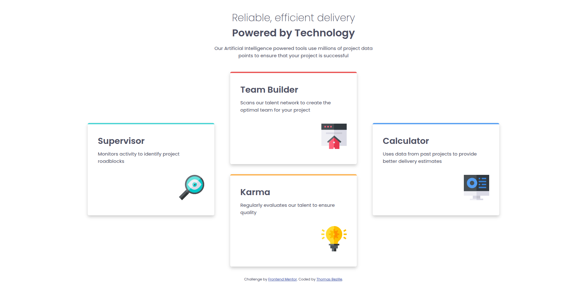
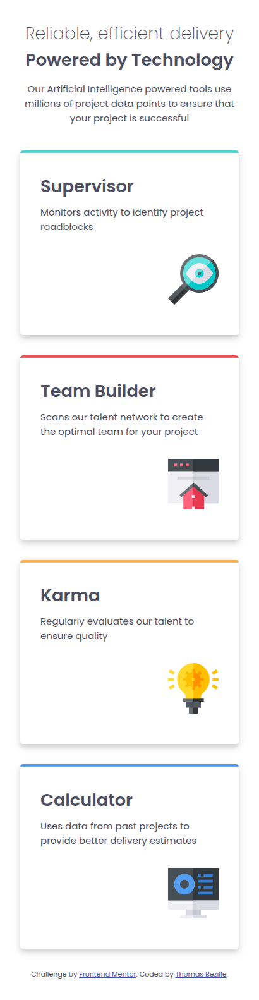

# Four card feature section

> Le challenge Four Card Feature Section de Frontend Mentor est un exercice de niveau newbie qui consiste à reproduire une section présentant quatre cartes de fonctionnalités avec un layout asymétrique. La difficulté principale de ce challenge réside dans le positionnement des cartes : les cartes de gauche et de droite occupent deux lignes de la grille tandis que les deux cartes centrales se superposent verticalement, créant ainsi un effet visuel équilibré. C'est un challenge idéal pour maîtriser CSS Grid et notamment l'utilisation de `grid-template-areas` et `grid-row` pour gérer des layouts complexes et asymétriques tout en conservant un design responsive et moderne.

**🔗 [Demo en ligne]()**

---

## 🎯 Objectif

Ce challenge a été réalisé dans le cadre de ma progression en développement frontend. Il consiste à reproduire fidèlement une section présentant quatre cartes de fonctionnalités avec un layout asymétrique et responsive à partir d'un design fourni par Frontend Mentor. Ce projet a été réalisé avec HTML5 et SCSS afin de consolider mes compétences en mise en page avancée avec CSS Grid.

**Ce que j'ai appris :**

- Structure sémantique HTML5 (`<section>`, `<article>`, `<h2>`, `
`)
- Utilisation de SCSS
- Mise en page avec CSS Grid (`grid-template-areas`, `grid-template-columns`, `grid-template-rows`)
- Centrage vertical des cartes avec `align-self: center`
- Limitation de la largeur du container avec `max-width` et `margin: 0 auto`
- Gestion des espacements avec `gap`, `padding` et `margin`
- Bordure colorée en haut des cartes avec `border-top`
- Typographie (`font-size`, `font-weight`, `line-height`, `color`)
- Gestion des couleurs et des ombres avec `box-shadow`
- Responsive design et approche mobile-first
- Utilisation des media queries pour adapter le layout
- Débogage et test sur différentes résolutions avec les DevTools

---

## 🛠️ Stack

---

## 👤 Contact

**Thomas Bezille** — Développeur web à Nantes

